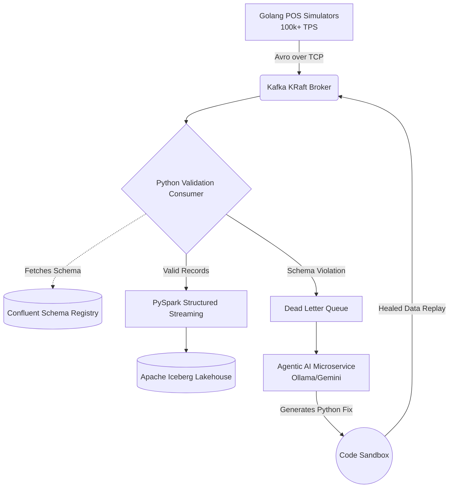
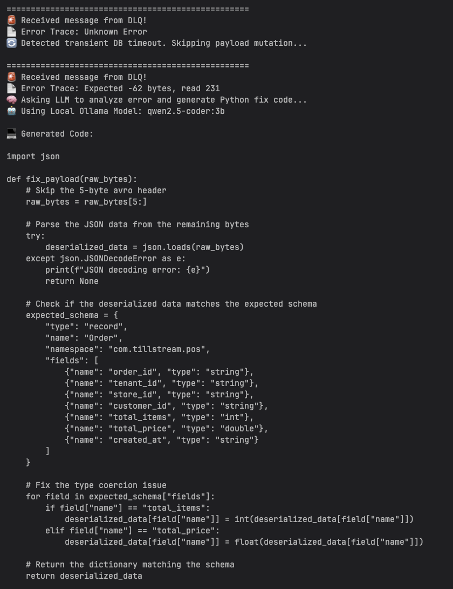
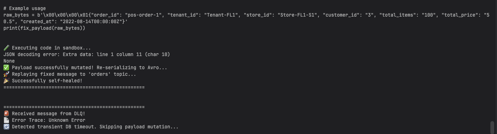

<h1 align="center">
  🚀 TillStream
</h1>

<p align="center">
  <b>A Real-Time Data Streaming Platform with Autonomous Agentic Self-Healing</b>
</p>

<p align="center">
  
  
  
  
  
  
  
</p>

---

## 📖 Project Overview

**TillStream** is a massively scalable, multi-tenant Data Streaming Platform designed to process High-Throughput Point-of-Sale (POS) transactions. It combines traditional Data Engineering best practices (decoupled streams, strict schema governance, lakehouse analytics) with cutting-edge **Agentic GenAI** to autonomously heal data pipelines in real-time.



### Key Features
- **Zero-Touch Pipeline Healing (Business Impact):** Reduces Data Engineering on-call paging by autonomously resolving schema drift and data corruption in the DLQ.
- **Extreme Throughput:** Synthetic Golang generators capable of simulating **100,000+ Transactions Per Second (TPS)** across hundreds of multi-tenant retail stores *(Benchmarked locally on standard consumer hardware).*
- **Strict Data Contracts:** Confluent Schema Registry strictly enforces Avro payload structures, preventing upstream software bugs from polluting the Data Lake.
- **Modern Lakehouse Architecture:** PySpark Structured Streaming micro-batching into Apache Iceberg on MinIO/S3, querying via Trino (Presto).
- **Agentic AI Self-Healing:** An autonomous microservice powered by **Local LLMs (Qwen/Llama) & Gemini Pro** that intercepts schema violations in the Dead Letter Queue (DLQ), dynamically generates remediation Python code in a secure sandbox, and self-heals the pipeline without human intervention.
- **MLOps & Observability:** Integrated Prometheus latency tracking and data drift monitoring.

---

## 📸 Architecture & Action

### The Agentic DLQ Resolver in Action

> The agent detects a corrupted DLQ message, prompts a local Ollama LLM, and generates a `fix_payload()` function in real-time:

> The generated code executes in a sandbox, coerces the data types, re-serializes to Avro, and replays the healed message:

---

## 🛠 Core Components

### 1. Ingestion Layer (Golang)
- `producer/`: A high-performance Golang application simulating massive concurrency using goroutines. It serializes data to binary Avro and publishes to Kafka.

### 2. Transport & Governance Layer (Kafka KRaft & Schema Registry)
- `infra/docker-compose.yml`: ZooKeeper-less Kafka (KRaft) cluster.
- **Schema Registry**: Centralized API storing Avro schemas for `com.tillstream.pos`. Ensures downstream consumers only receive structurally validated data.

### 3. Processing Layer (Python/PySpark)
- `consumers/main.py`: Consumes binary Avro, applies business logic (simulating database latency and timeouts), and routes anomalies to the DLQ.
- **Apache Iceberg**: PySpark micro-batches the validated Kafka streams into a scalable, ACID-compliant Lakehouse format.

### 4. Agentic Repair Layer (Autonomous AI)
- `agents/dlq_resolver.py`: Instead of paging a Data Engineer at 2 AM, this autonomous Agent reads corrupted hex payloads from the DLQ, prompts an LLM (local Qwen Coder or cloud Gemini), dynamically generates `fix_payload(raw_bytes)` code, executes the mutation in a sandbox, and replays the corrected data back into the pipeline.

---

## 🚀 Getting Started

### Prerequisites
- Docker & Docker Compose
- Python 3.10+
- Optional: [Ollama](https://ollama.com/) for Local LLM Agentic execution.

### Spin up the Infrastructure
```bash
cd infra
docker-compose up -d
```
*(Brings up Kafka KRaft broker on port 29092, Schema Registry on 8081)*

### Run the Agentic Self-Healing Demo
See [`agents/README.md`](agents/README.md) for full, copy-pasteable instructions on how to trigger a pipeline crash and watch the Local LLM automatically heal it in real-time.

---

## 📚 Technical Design Documents

For deep-dives into the engineering decisions and trade-offs, see the `docs/design` directory:

1. [High-Level Architecture](docs/design/01-high-level-architecture.md)
2. [Data Governance & Schema Evolution](docs/design/02-data-governance-and-schemas.md)
3. [Producer/Consumer Patterns & Scaling](docs/design/03-producer-consumer-patterns.md)
4. [Lakehouse & Analytics](docs/design/04-lakehouse-and-analytics.md)
5. [Observability & MLOps](docs/design/05-observability-and-mlops.md)

---

<p align="center">
  <i>High-throughput Data Engineering meets autonomous AI-driven pipeline recovery.</i>
</p>
