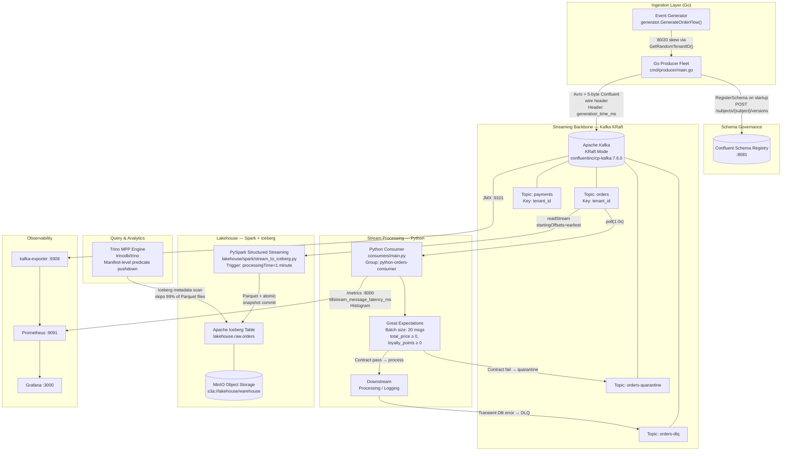

# TillStream: High-Level Architecture & System Topology

| Field | Value |
|---|---|
| **Document ID** | TILL-DESIGN-001 |
| **Status** | Approved |
| **Author** | Staff Data Engineer |
| **Last Updated** | August 2026 |
| **Reviewers** | Principal Engineer (Platform), Staff SRE, Data Science Lead |

---

## 1. Executive Summary

TillStream is a horizontally scalable, multi-tenant data platform purpose-built to ingest, govern, and archive Point-of-Sale (POS) transaction streams from a retail ecosystem exhibiting extreme traffic skew. The system processes two core event types — `orders` and `payments` — across a heterogeneous tenant population where a small subset of "Flagship" tenants generate approximately 80% of total event volume (Pareto distribution).

The platform is designed around three architectural pillars:

1. **Durability-first ingestion:** A Go producer fleet serializes events to Avro, enforces schema contracts at the wire level, and publishes to Apache Kafka with idempotent delivery guarantees.
2. **Decoupled consumption:** Independent consumer groups — a Python stream processor and a PySpark structured streaming job — subscribe to the same Kafka topics without coordination, enabling independent scaling and failure isolation.
3. **Open Lakehouse analytics:** PySpark appends micro-batches to Apache Iceberg tables stored on MinIO (S3-compatible), exposing a queryable surface via Trino for ad-hoc analytics and downstream ML feature pipelines.

This document covers system boundaries, technology selection rationale, capacity model, and the SLO framework that governs operational decision-making.

---

## 2. Problem Statement & Motivation

### 2.1 Business Context

A retail SaaS operator ingests POS transaction events from thousands of physical and virtual point-of-sale terminals across multiple tenants. Each event encodes a completed commercial transaction: item basket, total price, loyalty point accrual, payment instrument, and store identifier. The downstream consumers of this data include:

- **Real-time fraud and anomaly detection** (sub-second latency requirements)
- **Loyalty and wallet balance state machines** (strict per-tenant ordering requirements)
- **Analytical reporting and business intelligence** (high throughput, eventual consistency acceptable)
- **ML model training pipelines** (data quality and distribution stability requirements)

### 2.2 Core Engineering Challenges

| Challenge | Implication |
|---|---|
| Pareto traffic distribution (20% tenants → 80% volume) | Naive round-robin partitioning destroys per-tenant ordering; keyed partitioning creates hot partitions |
| Schema evolution across independent producer/consumer deployments | A breaking schema change in a multi-consumer system causes cascading pipeline failures |
| Dual serving: real-time stream processing and batch analytics from the same source | Operational and analytical workloads have fundamentally different latency/throughput trade-offs |
| Silent data corruption (negative prices, schema drift) | Garbage training data silently degrades ML model accuracy without triggering any infrastructure alerts |

---

## 3. Goals & Non-Goals

### 3.1 Goals

| # | Goal | Success Criterion |
|---|---|---|
| G1 | **High-throughput ingestion** | Sustain ≥ 100,000 msg/sec at p99 end-to-end latency < 50ms |
| G2 | **Tenant isolation** | Flagship tenant throughput degradation must not exceed 5% impact on SMB tenant latency SLO |
| G3 | **Zero data loss** | Events must be durable across a single-broker failure with `replication.factor=3`, `min.insync.replicas=2` |
| G4 | **Schema governance** | A breaking schema change must be rejected before it reaches a production Kafka broker (CI/CD gate) |
| G5 | **Lakehouse freshness** | p95 data visibility in Trino < 60 seconds after producer emission |
| G6 | **Operational observability** | Mean Time to Detect (MTTD) for pipeline failures < 2 minutes via automated alerting |

### 3.2 Non-Goals

- **Active-Active multi-region replication:** Cross-region conflict resolution for a POS state machine is a future-phase concern. Current topology is Active-Passive DR.
- **In-stream complex event processing (CEP):** Stateful windowed aggregations (e.g., fraud velocity checks across a sliding 60-second window) are handled downstream by dedicated Flink/Spark Streaming clusters, not the ingestion layer.
- **Consumer-side exactly-once to external databases:** ACID transactions to external OLTP stores are an application-layer concern outside this platform's scope.

---

## 4. System Architecture

### 4.1 Logical Architecture Diagram



### 4.2 Critical Path: Per-Message Lifecycle

The following sequence describes the end-to-end lifecycle for a single `orders` event from origin to Lakehouse availability:

```
1.  [Producer]  GenerateOrderFlow() → Order{tenant_id="TENANT_FLAGSHIP_1", ...}
                80% probability of Flagship tenant via GetRandomTenantID()

2.  [Producer]  avro.Marshal(orderAvroSchema, order) → binary bytes

3.  [Producer]  EncodeAvroWithMagicByte(schemaID, avroBytes):
                [0x00 | schemaID(4B big-endian)] + avroBytes  (5-byte Confluent wire header)

4.  [Producer]  tp.producer.Produce(topic="orders", key="TENANT_FLAGSHIP_1",
                  value=finalPayload,
                  headers={"generation_time_ms": strconv.FormatInt(time.Now().UnixMilli())})

5.  [Kafka]     murmur2("TENANT_FLAGSHIP_1") % 50 → partition N
                Replicate to all ISR brokers (replication.factor=3, min.insync.replicas=2)
                Producer blocks on deliveryChan until leader ACK received

6.  [Consumer]  msg = consumer.poll(1.0)
                magic, schema_id = struct.unpack('>bI', payload[:5])
                schema = schema_cache[schema_id] or sr_client.get_schema(schema_id)
                record = fastavro.schemaless_reader(BytesIO(payload[5:]), schema)

7.  [Consumer]  Accumulate record into batch (batch_size=20)
                On batch full: pd.DataFrame(batch_records) → ge.from_pandas(df)
                  expect_column_values_to_be_between('total_price', min_value=0)
                  expect_column_values_to_be_between('loyalty_points', min_value=0)
                On failure → dlq_producer.produce('orders-quarantine', ...)

8.  [Consumer]  Extract header generation_time_ms → latency_ms = now_ms - generation_time_ms
                LATENCY_HISTOGRAM.observe(latency_ms)  ← scraped by Prometheus :8000/metrics

9.  [Spark]     Parallel independent readStream, separate consumer group
                processingTime=1 minute batch trigger
                writeStream.format("iceberg") → lakehouse.raw.orders (Parquet + metadata commit)
                Checkpoint WAL at s3a://lakehouse/checkpoints/orders

10. [Trino]     SELECT ... FROM lakehouse.raw.orders WHERE date = 'today'
                Coordinator reads Iceberg metadata tree (Manifest List → Manifests)
                Column-level statistics (Min/Max) → prune irrelevant Parquet files
                Remaining files distributed to Worker fleet for parallel scan
```

---

## 5. Technology Selection

### 5.1 Message Broker: Kafka KRaft vs. Apache Pulsar vs. Amazon Kinesis

**Decision: Apache Kafka 7.6.0 (Confluent distribution, KRaft mode)**

| Criterion | Kafka KRaft | Apache Pulsar | Amazon Kinesis |
|---|---|---|---|
| **Ecosystem maturity** | ✅ De-facto standard; Schema Registry, Trino connector, Spark connector are first-class | ⚠️ BookKeeper-native; connectors require extra glue | ⚠️ AWS-native tooling only |
| **Metadata scalability** | ✅ KRaft eliminates ZooKeeper bottleneck | ✅ Separate metadata tier | ✅ Fully managed |
| **Throughput ceiling** | ✅ Millions of msg/sec per cluster | ✅ Comparable | ❌ 1 MB/sec/shard write limit |
| **Operational overhead** | ✅ KRaft reduces ops vs ZK-mode Kafka | ❌ Requires managing BookKeeper + ZK + brokers | ✅ Zero ops |
| **Vendor lock-in** | ✅ Open source, portable | ✅ Open source, portable | ❌ Hard AWS lock-in |
| **Schema Registry** | ✅ Confluent SR (native wire format) | ⚠️ Different wire format; consumer rewrite required | ❌ No native equivalent |

**Kinesis rejection rationale:** At the target 100k msg/sec with 500-byte payloads (50 MB/sec aggregate), Kinesis would require ≥ 50 shards. Shard splits are not instantaneous and require application-level resharding logic, introducing operational risk during traffic spikes. Kafka's dynamic partition reassignment is strictly superior for this workload.

**Pulsar rejection rationale:** Pulsar's BookKeeper storage disaggregation is architecturally elegant for storage-independent scaling, but TillStream's primary integration surface (Confluent Schema Registry wire format, Trino Kafka connector, Spark Kafka connector) is built for the Confluent ecosystem. Adopting Pulsar would require reimplementing the serialization layer across all three integration points.

### 5.2 Table Format: Apache Iceberg vs. Delta Lake vs. Apache Hudi

**Decision: Apache Iceberg 1.4.3 (`iceberg-spark-runtime-3.5_2.12`)**

| Criterion | Apache Iceberg | Delta Lake | Apache Hudi |
|---|---|---|---|
| **Engine agnosticism** | ✅ Spark, Trino, Flink, Hive — all first-class | ⚠️ Databricks-optimized; Trino support lags | ⚠️ Strong Spark coupling |
| **S3 LIST elimination** | ✅ Metadata tree; zero `S3 LIST` in query planning | ⚠️ Delta Log partially mitigates; not eliminated | ⚠️ Timeline-based; `S3 LIST` present in some paths |
| **ACID + concurrent writes** | ✅ Optimistic concurrency; atomic snapshot pointer swap | ✅ Strong ACID | ✅ MVCC-based |
| **Time travel** | ✅ `AS OF TIMESTAMP` or `AS OF VERSION` | ✅ `VERSION AS OF` | ✅ Commit timeline |
| **Schema evolution** | ✅ `ALTER TABLE ADD COLUMN` without rewrite | ✅ Supported | ✅ Supported |

**Key rationale:** The Trino coordinator's query planning phase reads Iceberg manifest files containing column-level Min/Max statistics. For a query scoped to a single day's data in a date-partitioned table, the coordinator prunes to the relevant manifest in O(1) operations — no `S3 LIST` calls issued. Delta Lake's `S3 LIST`-based discovery cannot provide this guarantee in all code paths.

### 5.3 Query Engine: Trino vs. PrestoDB vs. AWS Athena

**Decision: Trino (latest, `trinodb/trino`)**

| Criterion | Trino | PrestoDB | AWS Athena |
|---|---|---|---|
| **Iceberg integration** | ✅ Native; manifest-level pruning | ⚠️ Lagging Iceberg support | ⚠️ Iceberg v1 only; limited v2 features |
| **Cost model** | ✅ Fixed infrastructure cost | ✅ Fixed infrastructure cost | ❌ Per-TB scanned |
| **Cost-based optimizer** | ✅ Advanced CBO with column statistics | ⚠️ Less mature | ⚠️ Limited |
| **Worker fleet control** | ✅ Full control over JVM heap, worker count | ✅ Same | ❌ Managed; no tuning |

---

## 6. Capacity Model

### 6.1 Throughput & Network

At steady-state of **100,000 msg/sec**, average Avro-serialized payload **~500 bytes**:

| Resource | Calculation | Value |
|---|---|---|
| Raw network ingress | 100,000 msg/s × 500 B | **~50 MB/s** |
| Kafka replication overhead | 50 MB/s × replication factor 3 | **~150 MB/s** total cluster I/O |
| Minimum broker count | 1 per AZ, 3 AZs | **3 brokers** (`r6i.2xlarge` class) |
| Partition count (`orders`) | Target ≤ 2 MB/s per partition | **50 partitions** |
| Max consumer parallelism | = num_partitions | **50 workers per consumer group** |

### 6.2 Lakehouse Storage Projection

| Metric | Value |
|---|---|
| Events per 60s micro-batch | ~6,000,000 |
| Parquet file size (Snappy compressed) | ~150 MB per batch |
| Daily raw data volume | ~18 TB/day |
| Iceberg table partitioning strategy | `date(created_at)` + `tenant_id` |
| Trino metadata scan (single-day query) | < 200 manifest entries scanned |

### 6.3 Kafka Broker Configuration (Production Targets)

```properties
# Durability
replication.factor=3
min.insync.replicas=2

# Producer-side (confluent-kafka-go)
enable.idempotence=true
acks=all
queue.buffering.max.messages=100000
message.timeout.ms=300000

# Retention & segmentation
log.retention.hours=168        # 7-day replay window
log.segment.bytes=1073741824   # 1 GB segments

# Parallelism
num.partitions=50
num.replica.fetchers=4
```

---

## 7. Service Level Objectives (SLOs)

| SLO | Metric | Target | Measurement |
|---|---|---|---|
| **Ingestion availability** | Producer endpoint uptime | **99.99%** (< 52 min/year downtime) | Synthetic canary probes |
| **Ingestion latency** | p99 end-to-end (emit → consumer process) | **< 50ms** | `histogram_quantile(0.99, rate(tillstream_message_latency_ms_bucket[5m]))` |
| **Lakehouse freshness** | p95 data visible in Trino after emit | **< 60 seconds** | Spark trigger interval = 60s; watermark lag metric |
| **Data completeness** | Message loss rate (DLQ + quarantine / total) | **< 0.1%** | DLQ consumer group lag ratio |
| **Schema governance** | Breaking changes reaching production brokers | **0** | Schema Registry compatibility gate in CI/CD |

### 7.1 SLO Burn Rate Alerting (Multi-Window)

Following the Google SRE error budget burn rate model, TillStream implements two-window alerting for the latency SLO. A 30-day error budget allows 99.99% availability, consuming the budget at >1x means SLO will be missed if sustained.

```yaml
# Fast burn: ≥14.4x budget consumption over 1 hour
alert: TillStream_LatencyBudgetFastBurn
expr: >
  histogram_quantile(0.99,
    rate(tillstream_message_latency_ms_bucket[1h])) > 50
for: 2m

# Slow burn: ≥6x budget consumption over 6 hours
alert: TillStream_LatencyBudgetSlowBurn
expr: >
  histogram_quantile(0.99,
    rate(tillstream_message_latency_ms_bucket[6h])) > 50
for: 15m
```

---

## 8. Failure Mode Analysis (FMEA)

| Failure | Blast Radius | Detection | Recovery Mechanism | Validated? |
|---|---|---|---|---|
| Single Kafka broker loss | Partition leader re-election; ~30s consumer rebalance | `kafka_consumergroup_lag > 50` for 30s | KRaft re-elects leader; producer in-memory buffer flushes on reconnect | ✅ [INC-001](../incidents/INC-001-broker-failure.md) |
| Schema Registry outage | New producers blocked; consumers read from local schema cache | SR health check probe | Consumer LRU schema cache serves all previously seen schema IDs; SR not on critical read path | ⚠️ Not yet validated |
| Spark driver failure | Lakehouse writes halt; stream processor unaffected | Spark executor lost metrics | WAL checkpoint at `s3a://lakehouse/checkpoints/orders`; replacement driver resumes from committed offset | ⚠️ Not yet validated |
| Downstream DB timeout | Individual message routed to `orders-dlq` | DLQ consumer group lag spike | DLQ pattern (see TILL-DESIGN-003); manual replay tooling | ✅ Implemented in `consumers/main.py` |
| Data contract violation | 20-message batch quarantined | Great Expectations suite failure log | `orders-quarantine` topic; upstream incident raised | ✅ Implemented |
| Hot partition (> 10 MB/s/partition) | Producer throttle on specific partition | Per-partition byte rate in Grafana | Salted key pattern (TILL-DESIGN-003 §2.2); K-way merge on consumer | 🔲 Phase 2 |

---

## 9. Deployment Topology

### 9.1 Current State: Local Development (Docker Compose)

All services run in a single Docker Compose network (`docker-compose.yml`). This topology validates integration contracts but is a single point of failure by design.

```
localhost
├── broker:29092          (confluentinc/cp-kafka:7.6.0 — KRaft, single node)
├── schema-registry:8081  (confluentinc/cp-schema-registry:7.6.0)
├── producer              (Go binary — tillstream/producers)
├── consumer:8000         (Python — tillstream/consumers, Prometheus metrics endpoint)
├── kafka-exporter:9308   (danielqsj/kafka-exporter)
├── prometheus:9091       (prom/prometheus)
├── grafana:3000          (grafana/grafana)
├── minio:9000            (minio/minio — S3-compatible object store)
└── trino:8090            (trinodb/trino)
```

### 9.2 Target State: Production (3-AZ Deployment)

```
AZ-1                      AZ-2                      AZ-3
┌─────────────────┐       ┌─────────────────┐       ┌─────────────────┐
│  Kafka Broker   │       │  Kafka Broker   │       │  Kafka Broker   │
│  (KRaft Leader) │◄─────►│  (KRaft Voter)  │◄─────►│  (KRaft Voter)  │
└─────────────────┘       └─────────────────┘       └─────────────────┘
         ▲                         ▲                         ▲
         └─────────────────────────┼─────────────────────────┘
                                   │
               ┌───────────────────┴───────────────────┐
               │          Go Producer Fleet             │
               │   (Stateless; keyed by tenant_id)      │
               └───────────────────────────────────────┘
                                   │
               ┌───────────────────┴───────────────────┐
               │  Consumer Group A: python-orders       │
               │  Consumer Group B: spark-orders        │
               │  (Independent partition assignments)   │
               └───────────────────────────────────────┘
                                   │
               ┌───────────────────┴───────────────────┐
               │  MinIO / S3 (cross-AZ replication)    │
               │  Apache Iceberg table: raw.orders      │
               └───────────────────────────────────────┘
```

**Constraint:** `min.insync.replicas=2` requires at least 2 of 3 brokers to be healthy before a producer `acks=all` write is acknowledged. This ensures the cluster tolerates one broker failure without data loss or write unavailability (quorum preserved at 2/3).

---

*Related Documents: [TILL-DESIGN-002 Data Governance & Schema Evolution](./02-data-governance-and-schemas.md) | [TILL-DESIGN-003 Producer/Consumer Patterns](./03-producer-consumer-patterns.md) | [TILL-DESIGN-004 Lakehouse Architecture](./04-lakehouse-and-analytics.md) | [TILL-DESIGN-005 Observability & MLOps](./05-observability-and-mlops.md)*
