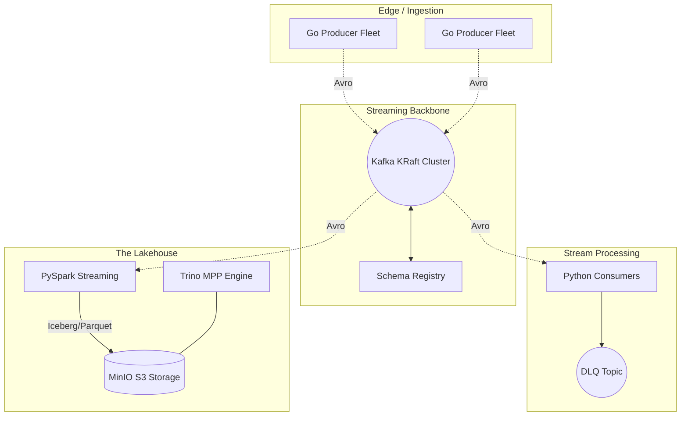

# Design Document 01: TillStream High-Level Architecture & Topologies

**Author:** Staff Data Engineer
**Status:** Approved
**Last Updated:** August 2026

## 1. Executive Summary
TillStream is a highly available, multi-tenant streaming data platform designed to process Point of Sale (POS) retail transactions at scale. This document outlines the high-level architecture, subsystem boundaries, and technology choices required to achieve a sustained throughput of 100,000+ messages per second with a sub-50ms p99 end-to-end latency budget, while bridging the gap between operational streaming and historical Lakehouse analytics.

## 2. Goals & Non-Goals
### 2.1 Goals
*   **High Throughput & Low Latency:** Support 100k+ msg/sec with sub-50ms processing latency.
*   **Strict Isolation:** Multi-tenant architecture ensuring noisy neighbor isolation (e.g., Flagship tenants do not degrade performance for SMB tenants).
*   **Unified Storage:** Consolidate real-time event streaming and batch analytical workloads via a Lakehouse architecture.
*   **Fault Tolerance:** Survive single Availability Zone (AZ) loss and catastrophic downstream database outages without data loss.

### 2.2 Non-Goals
*   In-stream complex event processing (CEP) requiring massive state stores (handled downstream by Flink/Spark).
*   Active-Active Multi-Region replication (restricted to Active-Passive for this phase).

## 3. System Context & Architecture Diagram

## 4. Subsystem Components & Trade-offs Considered

### 4.1 Message Broker: Kafka (KRaft) vs Pulsar vs Kinesis
*   **Decision:** Apache Kafka running in KRaft mode (KRaft consensus protocol).
*   **Alternative (Pulsar):** Pulsar separates compute and storage (BookKeeper), which is excellent for scaling independently, but Kafka's ecosystem maturity, particularly regarding Schema Registry and Trino integration, outweighed Pulsar's tiering benefits.
*   **Alternative (Kinesis):** Rejected due to vendor lock-in and strict 1MB/sec/shard write limits. Kafka KRaft provides superior metadata scalability by removing the ZooKeeper bottleneck.

### 4.2 Storage Format: Apache Iceberg vs Delta Lake vs Hudi
*   **Decision:** Apache Iceberg.
*   **Justification:** Iceberg's metadata tree structure (Manifest Lists -> Manifests -> Data Files) allows the Trino coordinator to plan massive queries without expensive `S3 LIST` operations. While Delta Lake is tightly coupled with Databricks, Iceberg provides a truly engine-agnostic open standard.

### 4.3 Query Engine: Trino vs PrestoDB vs Athena
*   **Decision:** Trino.
*   **Justification:** Trino's cost-based optimizer and pushdown predicates drastically reduce data scanned from MinIO. It handles memory-intensive `JOIN`s better than standard PrestoDB and avoids the per-TB scanned cost model of AWS Athena.

## 5. Capacity Planning & Scalability Projections
To support 100,000 msg/sec with an average payload of 500 bytes:
*   **Network Ingress:** ~50 MB/sec.
*   **Kafka Cluster Sizing:** Minimum 3 brokers across 3 AZs. `replication.factor=3`, `min.insync.replicas=2`. Ensures tolerance of 1 broker failure while maintaining quorum.
*   **Partition Strategy:** 50 partitions per topic to allow consumer groups to scale out to 50 concurrent worker nodes before hitting partition bottlenecks.

## 6. Service Level Objectives (SLOs)
*   **Availability:** 99.99% uptime for the ingestion endpoint.
*   **Latency:** 99th percentile (p99) end-to-end ingestion-to-consumer latency < 50ms.
*   **Data Freshness (Lakehouse):** 95th percentile (p95) data availability in Trino < 60 seconds (Spark micro-batch trigger interval).
