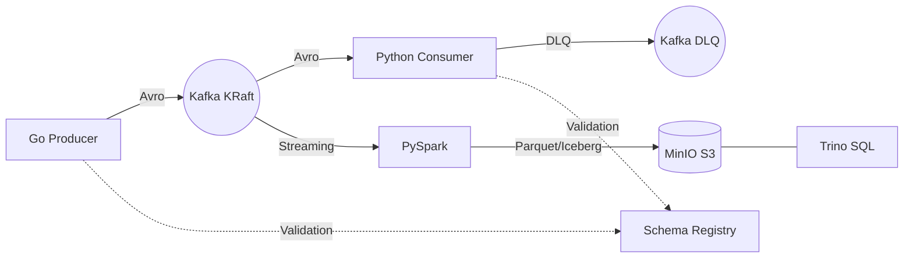

# Design Doc 01: High-Level Architecture

## Overview
**TillStream** is an end-to-end modern streaming data platform designed to simulate, process, and analyze high-volume Point of Sale (POS) retail transactions. The architecture is explicitly decoupled, ensuring fault-tolerance, high throughput, and strict data governance from ingestion to analytics.

## Core Tenets
1. **Event-Driven:** All state changes are immutable events published to a highly available message broker.
2. **Schema Enforcement:** No data enters the stream without strict contract validation.
3. **Decoupled Analytics:** Real-time processing and historical analytics share the same source of truth but operate on different compute engines.
4. **Resiliency First:** The system must gracefully handle downstream outages (e.g., database timeouts) and upstream infrastructure failures (e.g., broker crashes).

## System Architecture

## Component Breakdown
1. **Ingestion Layer (Golang)**
   - High-concurrency synthetic data generator.
   - Pushes serialized Avro records to Kafka topics (`orders`, `payments`).
2. **Message Broker (Apache Kafka)**
   - Runs in modern KRaft mode (no ZooKeeper dependency).
   - Handles partitioning, replication, and distributed log persistence.
3. **Consumption Layer (Python)**
   - Subscribes to topics via Consumer Groups for horizontal scalability.
   - Handles dynamic deserialization and business logic processing.
4. **The Lakehouse (Iceberg + Spark + Trino)**
   - **MinIO:** Acts as a local, S3-compatible object storage layer.
   - **Apache Spark:** Consumes the Kafka stream and writes out optimized Apache Iceberg tables.
   - **Trino:** A massively parallel SQL query engine connected to the Iceberg tables for lightning-fast analytics.

## Tech Stack
*   **Languages:** Golang, Python
*   **Infrastructure:** Docker Compose
*   **Streaming Engine:** Apache Kafka, Confluent Schema Registry
*   **Lakehouse:** Apache Iceberg, MinIO, Trino, PySpark
*   **Observability & MLOps:** Prometheus, Grafana, Great Expectations, Evidently AI
