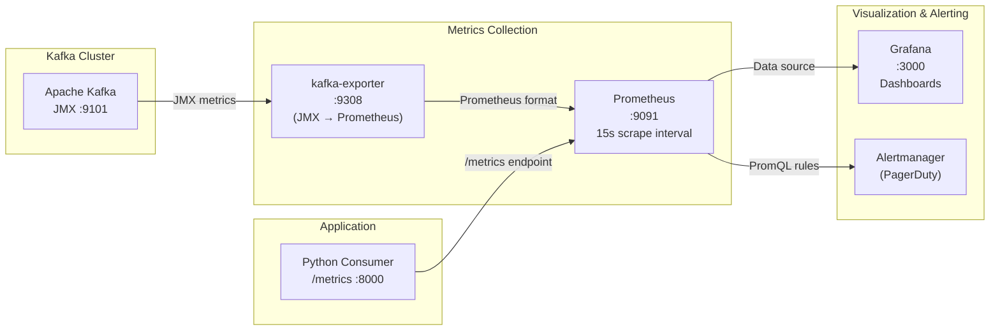

# TillStream: Observability, Data Contracts, & MLOps

| Field | Value |
|---|---|
| **Document ID** | TILL-DESIGN-005 |
| **Status** | Approved |
| **Author** | Staff Data Engineer |
| **Last Updated** | August 2026 |
| **Reviewers** | Principal Engineer (Platform), Data Science Lead, Staff SRE |

---

## 1. Executive Summary

A production data platform requires two distinct but complementary observability disciplines:

1. **Infrastructure Observability:** Are our services running? Are they keeping up with the event stream? This is answered by the Prometheus/Grafana/kafka-exporter stack — detecting and alerting on infrastructure failure modes within minutes.

2. **Data Observability:** Is the data correct? Even when all services are running and consumer lag is zero, the data itself can be silently corrupted — negative prices, impossible loyalty point values, or gradually shifting statistical distributions that degrade ML model accuracy over weeks. This is answered by Great Expectations (real-time batch validation) and Evidently AI (statistical drift detection).

The combination of these two disciplines constitutes TillStream's defense-in-depth data quality strategy. Neither alone is sufficient: infrastructure metrics tell you the pipe is running; data observability tells you the water is clean.

---

## 2. Infrastructure Observability Stack

### 2.1 Observability Architecture



### 2.2 The Consumer Lag Fallacy: Why Lag Alone Is an Insufficient SLI

Consumer lag (`kafka_consumergroup_lag`) measures the absolute delta between the producer's write offset and the consumer's committed offset on a given partition. A lag of 10,000 messages could mean:

- **10ms of delay** — if the consumer is processing 1M msg/sec and the lag is draining
- **10 hours of delay** — if the consumer has stalled completely

Lag alone cannot distinguish these two states. A stalled consumer at lag=0 (if it previously caught up) will show no alert, even though it has stopped processing new messages.

**TillStream's solution: Wall-clock end-to-end latency via header injection.**

### 2.3 True End-to-End Latency Measurement

**Producer side** (from [`producers/internal/kafka/producer.go`](../../producers/internal/kafka/producer.go)):

```go
Headers: []kafka.Header{
    {
        Key:   "generation_time_ms",
        Value: []byte(strconv.FormatInt(time.Now().UnixMilli(), 10)),
    },
},
```

The timestamp is captured via `time.Now().UnixMilli()` immediately before the `Produce()` call — representing the moment the event was ready for transmission. The timestamp is injected into the Kafka message header, not the payload body, to avoid schema changes.

**Consumer side** (from [`consumers/main.py`](../../consumers/main.py)):

```python
LATENCY_HISTOGRAM = Histogram(
    'tillstream_message_latency_ms',
    'End-to-End Latency in ms',
    buckets=[1, 5, 10, 25, 50, 100, 250, 500, 1000, 2500, 5000]
)

# Per-message latency calculation
if m.headers():
    for k, v in m.headers():
        if k == 'generation_time_ms':
            latency_ms = int(time.time() * 1000) - int(v.decode('utf-8'))
            if latency_ms >= 0:
                LATENCY_HISTOGRAM.observe(latency_ms)
```

**The `latency_ms >= 0` guard** handles clock skew edge cases: if the consumer's system clock is marginally behind the producer's due to NTP drift, a negative latency would be computed. This guard discards such samples rather than corrupting the histogram with impossible values.

**Clock synchronization assumption:** This measurement assumes NTP-synchronized clocks across the producer and consumer hosts with a drift bound < 1ms. In containerized environments (Docker Compose, Kubernetes), this is typically guaranteed by the host OS NTP configuration. A drift > 1ms introduces a systematic bias in the latency measurement that must be accounted for in SLO calculations.

### 2.4 Prometheus Histogram & PromQL Quantile Computation

The `Histogram` metric type is chosen over `Summary` for a critical reason: **Histograms enable cross-instance quantile aggregation; Summaries do not.**

When the Python consumer scales horizontally to N instances, a `Summary` computed locally by each instance cannot be aggregated across instances to produce a global p99 — the quantiles are already computed. A `Histogram` accumulates raw bucket counts that can be summed across instances before the quantile is computed:

```promql
# Global p99 across ALL consumer instances, over 5-minute window
histogram_quantile(
    0.99,
    sum(rate(tillstream_message_latency_ms_bucket[5m])) by (le)
)
```

**Bucket selection rationale:** The buckets `[1, 5, 10, 25, 50, 100, 250, 500, 1000, 2500, 5000]` are chosen to provide fine resolution around the 50ms SLO threshold. Buckets at 25ms and 50ms allow the histogram to accurately compute where the p99 falls relative to the SLO boundary. A Prometheus histogram can only compute quantile estimates within the bucket resolution — without a bucket at 50ms, the p99 estimate could be off by an entire bucket width.

### 2.5 Alert Rules

From [`infra/prometheus/alert.rules`](../../infra/prometheus/alert.rules):

```yaml
groups:
- name: kafka_alerts
  rules:
  - alert: HighConsumerLag
    expr: kafka_consumergroup_lag > 50
    for: 30s
    labels:
      severity: critical
    annotations:
      summary: "High Consumer Lag (Group: {{ $labels.consumergroup }})"
      description: >
        Consumer group {{ $labels.consumergroup }} on topic {{ $labels.topic }}
        has a lag of {{ $value }} messages. The consumer is falling behind the producer.
```

**Production hardening required:** The current alert fires on any consumer group lag > 50 messages sustained for 30 seconds. In a high-throughput environment, this threshold will generate alert noise during normal traffic spikes and Spark micro-batch processing windows. The recommended production alert set includes:

```yaml
# Alert 1: Consumer stall (lag increasing monotonically — actual problem)
- alert: ConsumerLagGrowing
  expr: >
    rate(kafka_consumergroup_lag[5m]) > 100
  for: 2m
  labels:
    severity: critical

# Alert 2: Latency SLO burn (from §2.3 measurement)
- alert: LatencySLOBreach
  expr: >
    histogram_quantile(0.99,
      sum(rate(tillstream_message_latency_ms_bucket[5m])) by (le)) > 50
  for: 5m
  labels:
    severity: critical

# Alert 3: DLQ spike (message routing failures increasing)
- alert: DLQMessageSpike
  expr: >
    rate(kafka_consumergroup_lag{topic="orders-dlq"}[5m]) > 10
  for: 1m
  labels:
    severity: warning
```

### 2.6 Grafana Dashboards

TillStream provisions Grafana with the **Kafka Exporter Overview** dashboard via GitOps (dashboard JSON in `infra/grafana/dashboards/`). Key panels:

| Panel | Metric | Alert Threshold |
|---|---|---|
| Messages In Rate (Broker) | `kafka_brokers_incoming_bytes_total` rate | < 1 MB/s (indicates producer stall) |
| Consumer Group Lag | `kafka_consumergroup_lag` | > 50 for 30s |
| Per-Partition Lag | `kafka_consumergroup_lag` by partition | Uneven distribution indicates hot partition |
| End-to-End Latency p99 | `histogram_quantile(0.99, ...)` | > 50ms |
| DLQ Message Rate | Rate on `orders-dlq` topic | Any non-zero value sustained > 1min |

---

## 3. Data Observability: Real-Time Contract Enforcement

### 3.1 The Silent Corruption Problem

Infrastructure observability cannot detect data quality issues. A consumer processing 100k msg/sec with zero lag and sub-10ms latency can simultaneously be ingesting records with `total_price = -500.00` — a perfectly healthy pipeline carrying corrupted data. Without real-time data quality enforcement, this corruption reaches the Iceberg Lakehouse and silently becomes training data for downstream ML models.

**The consequence:** A price prediction model trained on data containing negative prices will learn incorrect patterns. The model degrades silently over weeks as the corrupted data accumulates — with no infrastructure alert ever firing.

### 3.2 Great Expectations: Micro-Batch Contract Enforcement

TillStream applies **Great Expectations (GE)** validation on a micro-batch of 20 messages before committing their processing. This is a **quarantine gate**: the entire batch is either clean (all records valid) or quarantined (all records routed to `orders-quarantine` topic).

From [`consumers/main.py`](../../consumers/main.py):

```python
if len(batch_records) >= 20:
    df = pd.DataFrame(batch_records)
    ge_df = ge.from_pandas(df)

    res_price   = ge_df.expect_column_values_to_be_between('total_price',    min_value=0)
    res_loyalty = ge_df.expect_column_values_to_be_between('loyalty_points', min_value=0)

    if not res_price.success or not res_loyalty.success:
        print(f"DATA CONTRACT VIOLATION! Routing {len(batch_records)} records to Quarantine...")
        for m, p, r in batch_msgs:
            dlq_producer.produce('orders-quarantine', value=p, key=m.key())
    else:
        # Process clean batch
        for m, p, r in batch_msgs:
            ...
```

**Batch-level quarantine design rationale:** A per-record quarantine would route individual bad records while continuing to process the remainder. However, this creates a partial-commit problem: if record 7 of 20 is quarantined but records 1-6 and 8-20 are processed, what was the state of the batch? Batch-level quarantine is a conservative choice: it increases false-positive quarantine rate (a single bad record quarantines 19 good ones) but eliminates partial-commit ambiguity. At 0.1% expected violation rate, the blast radius is bounded to < 0.2% of total volume.

**Production expansion of the expectation suite:**

```python
# Current (Phase 4)
ge_df.expect_column_values_to_be_between('total_price', min_value=0)
ge_df.expect_column_values_to_be_between('loyalty_points', min_value=0)

# Target (Phase 6)
ge_df.expect_column_values_to_not_be_null('order_id')
ge_df.expect_column_values_to_match_regex('order_id', r'^[0-9a-f-]{36}$')  # UUID format
ge_df.expect_column_values_to_be_between('total_price', min_value=0, max_value=100000)
ge_df.expect_column_values_to_be_in_set('payment_method',
    ['CREDIT_CARD', 'DEBIT_CARD', 'CASH', 'DIGITAL_WALLET'])
ge_df.expect_column_values_to_be_between('loyalty_points', min_value=0, max_value=10000)
ge_df.expect_column_pair_values_a_to_be_greater_than_b('total_price', 'loyalty_points')
```

Each expectation is a named assertion that generates a structured result object. GE can export these results to a **Data Docs** site (HTML report) or to a metrics store (e.g., Prometheus) for dashboard integration.

### 3.3 Contract Violation Alerting

A quarantine routing event must trigger a P2 alert to the data quality on-call. The current implementation logs to stdout. Production requires:

```python
# On contract violation
if not res_price.success or not res_loyalty.success:
    # 1. Route to quarantine topic
    for m, p, r in batch_msgs:
        dlq_producer.produce('orders-quarantine', value=p, key=m.key())

    # 2. Increment violation counter (Prometheus)
    DATA_CONTRACT_VIOLATIONS.labels(
        expectation='price_or_loyalty_negative',
        tenant_id=batch_records[0].get('tenant_id', 'unknown')
    ).inc(len(batch_records))

    # 3. Alert (via Prometheus alertmanager rule on violation counter rate)
```

---

## 4. Data Observability: Statistical Drift Detection

### 4.1 The Drift Problem: Slow Silent Degradation

Great Expectations catches **immediate logical violations** — values that are structurally impossible (negative prices). It cannot detect **statistical distribution shifts** — changes in the *shape* of the data that are individually valid but represent a macro-level change in behaviour.

Examples of valid-but-drifted data:
- Average `total_price` shifts from $150 to $250 over 6 months (economic inflation / pricing changes)
- `payment_method` distribution shifts from 60% credit card to 40% digital wallet (consumer behaviour change)
- `loyalty_points` distribution becomes bimodal (new loyalty tier introduced)

All of these produce individually valid records that pass Great Expectations. All of them silently degrade ML models trained on the historical distribution.

### 4.2 Evidently AI: Kolmogorov-Smirnov & Jensen-Shannon Divergence

From [`lakehouse/mlops/evidently_drift.py`](../../lakehouse/mlops/evidently_drift.py):

```python
from evidently.report import Report
from evidently.metric_preset import DataDriftPreset

# Reference: historical distribution (e.g., last 90 days from Iceberg)
reference_data = pd.DataFrame({
    'total_price': np.random.normal(loc=150.0, scale=30.0, size=1000)
})

# Current: recent window (e.g., last 7 days from Iceberg)
current_data = pd.DataFrame({
    'total_price': np.random.normal(loc=250.0, scale=50.0, size=1000)
})

data_drift_report = Report(metrics=[DataDriftPreset()])
data_drift_report.run(reference_data=reference_data, current_data=current_data)
data_drift_report.save_html("data_drift_report.html")
```

**Statistical tests applied by `DataDriftPreset`:**

| Feature Type | Test | Interpretation |
|---|---|---|
| Numerical (`total_price`, `loyalty_points`) | Kolmogorov-Smirnov (KS) test | Tests whether two samples are drawn from the same distribution. KS statistic = maximum absolute difference between empirical CDFs. p-value < 0.05 → distributions are different at 95% confidence. |
| Categorical (`payment_method`, `status`) | Jensen-Shannon Divergence (JSD) | Symmetric measure of divergence between two probability distributions. JSD = 0 means identical; JSD = 1 means maximally different. Threshold > 0.1 triggers alert. |

**The `loc=250.0` vs `loc=150.0` simulation** in the current script deliberately represents a 67% mean price increase — a scenario that would trigger the KS test with p < 0.001 and generate a drift alert. This validates that the Evidently pipeline is correctly detecting meaningful distribution shifts.

### 4.3 Production Integration Pattern

The current Evidently script uses simulated in-memory DataFrames. Production integration requires:

```python
# Production: fetch from Iceberg via Trino
import trino

conn = trino.dbapi.connect(
    host='trino', port=8080, user='ml-pipeline', catalog='lakehouse', schema='raw'
)

cursor = conn.cursor()

# Reference: 90-day historical baseline
cursor.execute("""
    SELECT total_price, loyalty_points, payment_method
    FROM orders
    WHERE created_at BETWEEN CURRENT_DATE - INTERVAL '90' DAY
                         AND CURRENT_DATE - INTERVAL '7' DAY
""")
reference_data = pd.DataFrame(cursor.fetchall(),
    columns=['total_price', 'loyalty_points', 'payment_method'])

# Current: last 7 days
cursor.execute("""
    SELECT total_price, loyalty_points, payment_method
    FROM orders
    WHERE created_at >= CURRENT_DATE - INTERVAL '7' DAY
""")
current_data = pd.DataFrame(cursor.fetchall(),
    columns=['total_price', 'loyalty_points', 'payment_method'])
```

### 4.4 Drift Reporting & Alerting Pipeline

```
Airflow DAG: tillstream_drift_detection
├── Trigger: Daily @ 02:00 UTC
├── Task 1: fetch_reference_data  (Trino → Pandas DataFrame)
├── Task 2: fetch_current_data    (Trino → Pandas DataFrame)
├── Task 3: run_evidently_report  (DataDriftPreset → HTML + JSON)
├── Task 4: evaluate_drift_result
│   ├── IF drift detected (KS p < 0.05 OR JSD > 0.1)
│   │   ├── Upload HTML report to S3 (audit trail)
│   │   ├── POST alert to Data Science Slack channel
│   │   └── Trigger ML model retrain Airflow DAG
│   └── ELSE: Log no-drift result, upload report
└── Task 5: archive_report_to_iceberg (audit table: drift_reports)
```

### 4.5 Drift Detection Thresholds

| Feature | Drift Metric | Alert Threshold | Justification |
|---|---|---|---|
| `total_price` | KS statistic, p-value | p < 0.05 | 5% false positive rate acceptable for daily model retrain trigger |
| `loyalty_points` | KS statistic, p-value | p < 0.05 | Same |
| `payment_method` | Jensen-Shannon divergence | JSD > 0.1 | JSD of 0.1 represents a ~10% distribution shift — meaningful for a payment method classifier |
| Any feature | Evidently dataset drift threshold | > 50% of features drifting | Global dataset drift indicator; triggers emergency model review |

---

## 5. Observability Coverage Matrix

| Failure Mode | Detected By | Detection Latency | Alerting Mechanism |
|---|---|---|---|
| Kafka broker failure | kafka-exporter → Prometheus → `HighConsumerLag` | < 2 minutes | PagerDuty P1 |
| Consumer process crash | Consumer lag accumulates → `ConsumerLagGrowing` | < 2 minutes | PagerDuty P1 |
| Schema Registry outage | SR health check probe | < 1 minute | PagerDuty P2 |
| Data contract violation (negative price) | Great Expectations batch validation | Per batch (~20 msgs) | Slack alert + quarantine routing |
| Statistical data drift | Evidently AI KS/JSD tests | Daily (next scheduled run) | Slack alert + model retrain trigger |
| Hot partition (producer throttle) | Per-partition byte rate Grafana panel | Real-time | Manual investigation (no automated alert yet) |
| Spark streaming job failure | Spark UI / driver heartbeat | < 5 minutes | Manual monitoring (Phase 7: add structured logging + alerting) |

**Coverage gap:** Spark streaming failures are not currently auto-detected. The Lakehouse freshness SLO (p95 data visible in Trino < 60 seconds) will silently breach without alerting. Phase 7 must add a Prometheus pushgateway integration to the Spark job to expose a `last_successful_commit_timestamp` gauge metric, enabling a Prometheus alert on staleness.

---

*Related Documents: [TILL-DESIGN-001 High-Level Architecture](./01-high-level-architecture.md) | [TILL-DESIGN-003 Producer/Consumer Patterns](./03-producer-consumer-patterns.md) | [TILL-DESIGN-004 Lakehouse Architecture](./04-lakehouse-and-analytics.md)*
