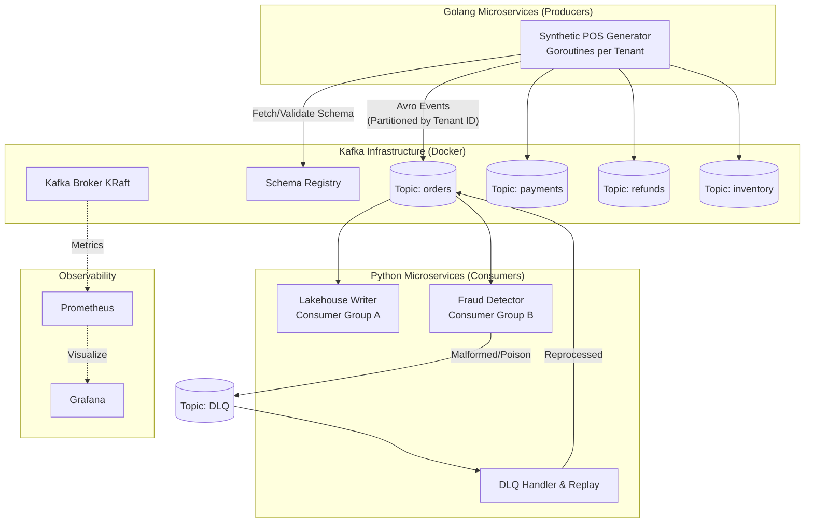

# TillStream: Solution Design

## System Architecture

## Component Design

### 1. The Golang Producer Layer
* **Role**: Simulates extreme volume and concurrency.
* **Design**: A single Go binary that spins up a Goroutine for each "Store" or "Tenant". It will use a weighted randomization algorithm to simulate realistic volume skew (e.g., flagship stores generate 100x the volume of local branches).
* **Serialization**: Uses a Go Avro library to serialize JSON/Struct payloads against the Confluent Schema Registry before publishing.

### 2. The Kafka Layer
* **Topics**: `orders`, `payments`, `refunds`, `inventory-adjustments`.
* **Partitioning**: Messages are keyed by `tenant_id`. This guarantees ordering per tenant and allows us to intentionally cause hot partitions (due to volume skew) to test scaling and rebalancing.

### 3. The Python Consumer Layer
* **Role**: Handles business logic, data routing, and complex error handling.
* **Consumer Group A (Lakehouse)**: A straightforward Python consumer that deserializes Avro and writes batches to disk (simulating a Data Lake entry point).
* **Consumer Group B (Fraud/Rules)**: Applies business logic. Will intentionally be designed to fail on certain "poison" messages to trigger the DLQ flow.
* **DLQ Handler**: A specialized consumer that reads from `dead-letter-queue`, logs the failure reason, and provides a CLI/API to modify the payload and replay it to the original topic.

### 4. Schema Governance (Avro)
* Schemas are centrally defined in `.avsc` files.
* Both Go producers and Python consumers must communicate with the Schema Registry.
* We will enforce `BACKWARD` compatibility to allow safe schema evolution during Phase 3.
